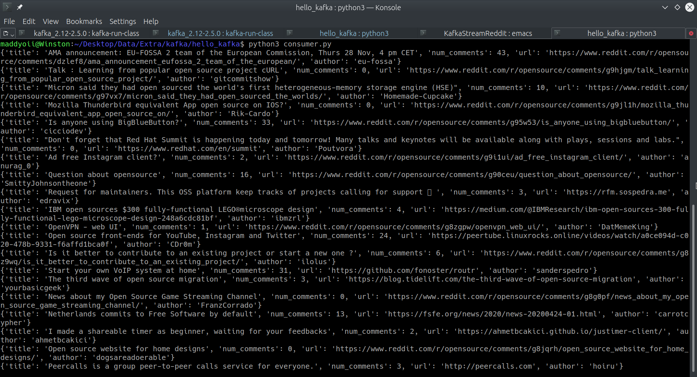

# Streaming Reddit Posts using Apache Kafka

An atttemp at understanding the working of Apache Kafka and using it to stream reddit posts

The steps listed below assume that the user is running a Linux based operating system.
However, the Windows counterpart is available as well.

## Requirements
- Apache Kafka
- Python 3.x
- Reddit API Credentials

You can download Kafka 2.5.0 from [here](https://www.apache.org/dyn/closer.cgi?path=/kafka/2.5.0/kafka_2.12-2.5.0.tgz)

After downloading the code, go ahead and un-tar it
```tar -xzf kafka_2.12-2.5.0.tgz```

```cd kafka_2.12-2.5.0```

Start a single instance of ZooKeeper that comes as a convenience script with Kafka by running the following
```bin/zookeeper-server-start.sh config/zookeeper.properties```

In a new terminal, start the Kafka server by running:
```bin/kafka-server-start.sh config/server.properties```

In a new terminal, create a topic. The topic used in the code is ```redditStream```, name it according to your convenience
```bin/kafka-topics.sh --create --bootstrap-server localhost:9092 --replication-factor 1 --partitions 1 --topic <topic-name>```


## Python dependencies
- kafka-python
- praw (python wrapper for the Reddit API)
- flask

You can install the required python dependenices by running the following command:
```pip3 install -r requirements.txt``` or ```pip install -r requirements.txt```

After setting up everything mentioned above, go ahead and start an instance of a Kafka producer which runs a Flask server
```python3 producer.py``` or ```python producer.py```

You can change a bunch of options in ```consumer.py```, after doing so, start an instance of a Kafka consumer  
```python3 consumer.py``` or ```python consumer.py```

You should be able to see information about Reddit posts in the form of JSON objects appearing on the terminal.
For the following configuration in ```consumer.py```  
```py stream = StreamReddit("OpenSource", comments = False, limit=20, num_comments = True)```
the output should look like




If you feel like anything isn't factually correct or is a straightup error, please do raise an issue, I'd love to learn :) 